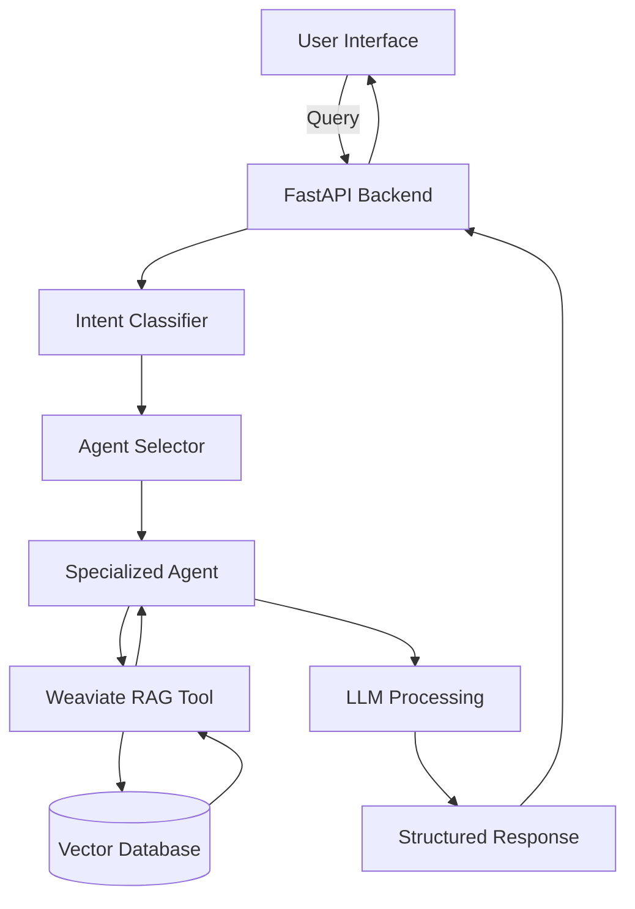

# 🤖 Agentic RAG Travel Assistant

[](https://python.org)
[](https://fastapi.tiangolo.com)
[](https://crewai.com)
[](LICENSE)

A sophisticated multi-agent AI system that serves as an intelligent travel assistant, combining Retrieval-Augmented Generation (RAG) with specialized agents to provide contextually accurate and comprehensive travel information.

## 🌟 Overview

The Agentic RAG Travel Assistant leverages cutting-edge AI technologies to revolutionize travel planning and information retrieval. By dynamically classifying user intent and delegating tasks to specialized agents, the system delivers personalized, accurate, and up-to-date travel recommendations.

### Key Capabilities

- **Multi-Agent Architecture**: Orchestrated specialist agents for accommodations, dining, activities, and safety
- **Intent Classification**: Automatic query categorization for optimal agent selection
- **RAG-Powered Responses**: Context-aware answers backed by real-time data retrieval
- **Hybrid LLM Processing**: Local inference with cloud-based classification for optimal performance
- **RESTful API**: Clean, scalable backend architecture for easy integration

## 🚀 Quick Start

### Prerequisites

- Python 3.10 or higher
- Docker & Docker Compose
- [Ollama](https://ollama.ai) installed locally
- Google AI Studio API key
- Ngrok authentication token

### Installation

1. **Clone the repository**
   ```bash
   git clone https://github.com/Anasmahmoud00/Agentic_Rag.git
   cd Agentic_Rag
   ```

2. **Set up Python environment**
   ```bash
   python -m venv venv
   source venv/bin/activate  # On Windows: venv\Scripts\activate
   pip install -r requirements.txt
   ```

3. **Configure environment variables**
   ```bash
   cp .env.example .env
   ```
   
   Edit `.env` with your credentials:
   ```env
   GEMINI_API_KEY=your_google_ai_studio_key
   NGROK_AUTH_TOKEN=your_ngrok_token
   WEAVIATE_URL=http://localhost:8080
   ```

4. **Start required services**
   ```bash
   # Start Weaviate database
   docker-compose up -d
   
   # Pull and start Ollama model
   ollama pull llama3.1:8b-instruct-q8_0
   ```

5. **Launch the application**
   ```bash
   python api/main.py
   ```

   Access your assistant at the provided ngrok URL!

## 🏗️ Architecture



### Core Components

- **CrewAI Framework**: Orchestrates multi-agent workflows
- **Weaviate Vector DB**: Stores and retrieves travel knowledge
- **Ollama + Llama 3.1**: Local LLM for response generation
- **Google Gemini**: Cloud-based intent classification
- **FastAPI**: High-performance API layer
- **Sentence Transformers**: Vector embedding generation

## 📁 Project Structure

```
Agentic_Rag/
├── api/
│   └── main.py                 # FastAPI application
├── core/
│   ├── agents/
│   │   └── rag_crew.py        # Agent definitions & workflows
│   ├── models/
│   │   └── schemas.py         # Pydantic response models
│   └── services/
│       └── classification.py  # Intent classification logic
├── tools/
│   ├── weaviate_search_tool.py # Custom RAG tool
│   └── weaviate_tools/
│       └── vectorizer.py      # Embedding utilities
├── ui/
│   └── index.html             # Web interface
├── config/
│   └── weaviate_setup/        # Database configuration
├── tests/
│   └── test.py                # Test suite
├── requirements.txt           # Dependencies
└── README.md                  # This file
```

## 🛠️ Technology Stack

| Component | Technology | Purpose |
|-----------|------------|---------|
| **AI Framework** | CrewAI, LangChain | Multi-agent orchestration |
| **Backend** | FastAPI, Uvicorn | RESTful API server |
| **Local LLM** | Ollama, Llama 3.1 | Response generation |
| **Cloud LLM** | Google Gemini | Intent classification |
| **Vector DB** | Weaviate | Knowledge storage & retrieval |
| **Embeddings** | Sentence Transformers | Vector generation |
| **Validation** | Pydantic | Data structure validation |
| **Tunneling** | Ngrok | Public URL exposure |

## 🔧 Usage

### Web Interface

Navigate to your ngrok URL to access the interactive chat interface where you can ask travel-related questions.

### API Endpoints

#### Get Travel Assistance
```http
GET /api/run_crew?query=your_travel_question
```

**Example:**
```bash
curl -X GET "https://your-ngrok-url.ngrok-free.app/api/run_crew?query=best+restaurants+in+tokyo"
```

**Response:**
```json
{
  "intent": "restaurant",
  "response": {
    "recommendations": [
      {
        "name": "Sukiyabashi Jiro",
        "type": "Sushi",
        "location": "Ginza",
        "price_range": "$$$$"
      }
    ]
  }
}
```

## 📊 Agent Specializations

| Agent Type | Expertise | Example Queries |
|------------|-----------|----------------|
| **Accommodation** | Hotels, hostels, booking | "Where to stay in Paris?" |
| **Dining** | Restaurants, local cuisine | "Best street food in Bangkok?" |
| **Activities** | Attractions, tours, events | "Things to do in Rome?" |
| **Safety** | Scams, safety tips | "Common scams in tourist areas?" |

## 🧪 Testing

Run the test suite to verify functionality:

```bash
python -m pytest tests/ -v
```

## 🔄 Development Workflow

1. **Fork the repository**
2. **Create a feature branch**
   ```bash
   git checkout -b feature/your-feature-name
   ```
3. **Make your changes**
4. **Run tests**
5. **Submit a pull request**

## 📈 Performance Optimization

- **Hybrid LLM Strategy**: Local processing for complex reasoning, cloud for quick classification
- **Vector Caching**: Optimized retrieval with Weaviate's indexing
- **Async Processing**: Non-blocking API operations with FastAPI
- **Structured Outputs**: Pydantic models ensure consistent response formats


- [CrewAI](https://crewai.com) for the multi-agent framework
- [Weaviate](https://weaviate.io) for vector database capabilities
- [Ollama](https://ollama.ai) for local LLM inference
- [FastAPI](https://fastapi.tiangolo.com) for the robust API framework
